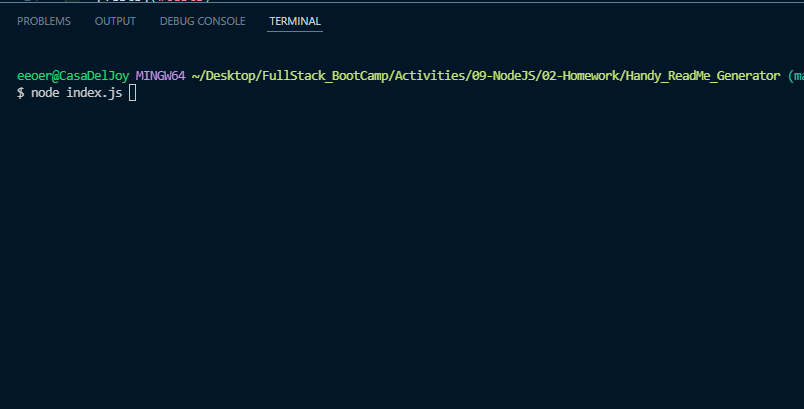
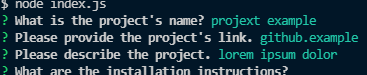

# Handy_ReadMe_Generator

## Link:https://github.com/eeoerkeedu/Handy_ReadMe_Generator
	
## Description 
An efficient and handy readme generator for github projects. Uses node.js and inquirer npm to get the answers need to fill out a readme. Built to save time on future projects.

## Table of Contents
  * [Installation](#installation)
  * [Usage](#usage)
  * [License](#license)
  * [How to Contribute](#How to Contribute)
  * [Tests](#tests)
  * [Questions](#questions)

## Installation 
Be sure to instal node.js, npm, and inquirer npm before running.
	
## Usage 
enter on the command line 'node index.js' and the program will launch. Answer the prompts aand it will generate the information entered in a .md file with the title of the project.

## Video tutorial: https://drive.google.com/file/d/1vET3OQf_S12Bxa-ak_rWMZfd3FSCIocF/view

## Screenshots

 _______________________________________________________

 _______________________________________________________

## License 
This project is licensed under  MIT

For deatils visit https://choosealicense.com/licenses/mit/

## How to Contribute 
TBD

## Tests
TBD

## Questions
Find an issue or have a question? Contact me via email eeoerkeedu@gmail.com. 
If you liked what you found, you can view more of my projects at: 
https://github.com/eeoerkeedu.
